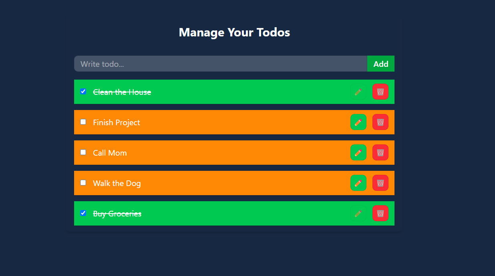

# ToDo Application

A simple yet powerful ToDo application built using **React**, **Vite**, and **Tailwind CSS**. This app allows users to manage their daily tasks efficiently with features like adding, editing, marking as complete, and deleting tasks. The application also persists data using **localStorage**.

## Screenshot



## Features

✅ Add new tasks easily.  
✅ Mark tasks as completed or pending.  
✅ Edit tasks directly within the list.  
✅ Delete tasks with a single click.  
✅ Data persists even after page refresh via **localStorage**.

## Tech Stack

- **React** (with Vite for fast development)
- **Tailwind CSS** (for responsive and modern styling)

## Installation

1. Clone the repository:

   ```bash
   git clone https://github.com/your-username/todo-app.git
   cd todo-app
   ```

2. Install dependencies:

   ```bash
   npm install
   ```

3. Run the development server:

   ```bash
   npm run dev
   ```

4. Open [http://localhost:5173](http://localhost:5173) in your browser to view the app.

## Usage

- **Add a Task:** Type your task in the input field and click `Add`.
- **Mark as Complete:** Click the checkbox to toggle completion status.
- **Edit a Task:** Click `Edit`, modify the text, and click `Save`.
- **Delete a Task:** Click the `Delete` button to remove a task.

## Project Structure

```
/src
 ├── components
 │   ├── ToDoForm.jsx
 │   ├── ToDoItem.jsx
 ├── contexts
 │   ├── ToDoContext.jsx
 │   ├── index.js
 ├── App.jsx
 ├── main.jsx
 └── index.css
```

## Contributing

Contributions are welcome! If you find any issues or have feature requests, feel free to create a pull request or open an issue.

## License

This project is licensed under the **MIT License**.

---

**Happy Coding! 🚀**
